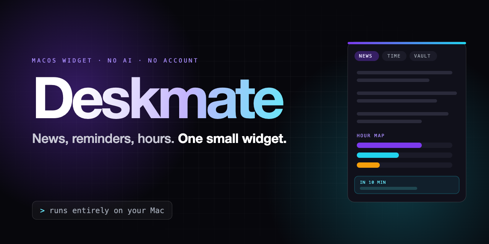

# Deskmate



A small floating widget for your Mac with four things in it: **news**, **calendar reminders with an hour tracker**,
**a quick-copy vault**, and **a look you can change completely**.

No AI, no account, no tracking. It runs entirely on your Mac and only goes online to read public news feeds
(and your calendar's iCal link, if you choose to use one).

## What it does

**1. News: Tech · Politics · Economy.** Deskmate reads free public RSS feeds (BBC, NYT, CNBC, SCMP, RTHK,
HKFP, The Verge, Ars Technica, TechCrunch, Politico) and sorts the headlines into three tabs. Click a headline
to open it in your browser. It refreshes every 15 minutes, and near-identical headlines from different outlets
are shown once.

**2. Calendar reminders + Hour Map.** Before each event a reminder card pops out in the top-right corner of
your screen. You choose how early: 1 minute to 1 day, with a different lead time per calendar if you want.
The card lets you **Snooze**, **Dismiss**, or **Track time**. Track time starts the Hour Map timer for that
event. The **Hour Map** answers "where did my week go?" Start and stop a timer for a project, or let Deskmate
count finished calendar events that match a rule (for example, the calendar "Work", or any title with "ECON").
It shows a bar for each project, and you can export everything to CSV.
Deskmate only **reads** your calendar. It never creates, changes or deletes an event.

**3. Vault.** Save the things you paste all the time: your LinkedIn URL, GitHub, email, phone, a short bio.
One click copies it. Press **⌃⌥V** (Control + Option + V) from any app to open the vault.
The vault is a plain file on your Mac, so **don't save passwords in it.**

**4. Look.** Change the background, accent and text colours, or pick a preset. Choose the collapsed badge
shape (circle, pill, rounded, square) and set the badge size, panel corners, width, height, text size and
opacity. You can also choose whether it stays on top. Changes apply live, and **Reset look to default** undoes
them. Drag the widget anywhere and it remembers where you left it.

## Install

1. Download `Deskmate.zip` and double-click it to unzip.
2. Drag **Deskmate.app** into your **Applications** folder.
3. **First launch only:** Deskmate is free and not signed with a paid Apple developer certificate, so macOS
   blocks it once.
   - macOS 13–14: right-click Deskmate.app → **Open** → **Open**.
   - macOS 15 and later: double-click it, close the warning, then go to System Settings → Privacy & Security,
     scroll down and click **Open Anyway**.
4. A widget appears in the top-right corner, plus an icon in your menu bar.

## Connect your Google Calendar

Deskmate never asks for your Google password. Pick one of two ways. **Option A** is recommended.

| | Option A: through your Mac | Option B: secret iCal link |
|---|---|---|
| Setup | About 2 minutes | About 1 minute |
| Works with school/work Google accounts | Yes | Often blocked by the admin |
| Several calendars at once | Yes, plus iCloud and Outlook | One link per calendar |
| How fresh | Updates instantly | Up to ~5 min late (Google can lag longer) |

### Option A: through your Mac (recommended)

**Step 1. Add Google to your Mac.** Skip this if your Google calendars already show in the Calendar app.
1. Open **System Settings** → **Internet Accounts**.
2. Click **Add Account…** → **Google**.
3. A Google sign-in page opens in your browser. Sign in there. (This is Apple and Google; Deskmate never sees it.)
4. When asked which apps to use with this account, make sure **Calendars** is ticked.
5. Open the **Calendar** app and check your Google events appear. The first sync can take a minute.

**Step 2. Let Deskmate read your calendar.**
1. Open the Deskmate widget and click the **Time** tab.
2. Click **Connect Calendar**.
3. macOS asks *"Deskmate would like full access to your Calendar"*. Click **Allow**.
4. Your events now show under **Upcoming**, and the collapsed badge counts down to your next event.

**Step 3 (optional). Choose your reminders.**
- Set the default lead time on the Time tab ("Remind me 10 min before").
- In **Settings → Reminders** you can untick calendars you don't want reminders for, or give one calendar its
  own lead time (for example, 1 day before for "Exams").
- Click **Show a test reminder** to see what the pop-out looks like.

Deskmate only *reads* your calendar. It never creates, changes or deletes an event.

### Option B: secret iCal link

1. On a computer, open **calendar.google.com**.
2. Click the gear ⚙ (top right) → **Settings**.
3. In the left column, under **Settings for my calendars**, click the calendar you want.
4. Scroll to **Integrate calendar** and copy **Secret address in iCal format** (it ends in `basic.ics`).
   Copy the *secret* one. The "Public address" only works if the calendar is public.
5. In Deskmate: **Settings → Reminders → Source** → choose **Google secret iCal address**, then paste the link.
6. Your events appear in the Time tab within a few seconds.

⚠ Treat this link like a password: anyone who has it can see your events. If it ever leaks, click **Reset**
next to it in Google Calendar, and the old link stops working.

### If it doesn't work

| What you see | Fix |
|---|---|
| "Deskmate doesn't have Calendar access" | You clicked Don't Allow. Go to System Settings → Privacy & Security → **Calendars**, switch on **Deskmate**, then quit and reopen Deskmate. |
| Connected, but no Google events | Google isn't in the Calendar app yet (Option A, Step 1), or the Calendars tick is off in Internet Accounts. |
| Some calendars missing | Settings → Reminders: a calendar may be unticked. Or the calendar is hidden in Google: in Google Calendar on the web, tick it under "My calendars". |
| "Couldn't read that iCal address" | You copied the public address, or only part of the link. Copy the whole **Secret address** again. |
| No "Secret address" in Google settings | Your school or work admin has switched it off. Use Option A. |
| No reminder pop-outs | The switch on the Time tab is off, or Deskmate isn't running. Turn on Settings → General → **Open Deskmate when I log in**. |
| Calendar access stopped after updating Deskmate | macOS treats each new unsigned build as a new app. Switch Deskmate off and on again in Privacy & Security → Calendars. |

## Shortcuts

| Keys | Does |
|---|---|
| ⌃⌥D | Show / hide the widget |
| ⌃⌥V | Open the vault |
| Click the badge | Expand the widget |
| `–` in the header | Collapse to the badge |

You can turn the shortcuts off in Settings → General.

## How the news sorting works (no AI)

Each feed is either **fixed** to a tab (for example, BBC Business → Economy) or set to **Auto**. For an Auto
feed, every headline is checked against three keyword lists, one per tab. It goes to the tab with the most
matches, and if nothing matches it is skipped. You can see and edit the keywords, and add, remove or recategorise
feeds, in Settings → News. English keywords match whole words, so "AI" doesn't match "said". Chinese
keywords (中文) match anywhere in the headline.

## Your data

Everything is stored in `~/Library/Application Support/Deskmate/`:
`settings.json` (look, feeds, reminders, projects), `vault.json`, and `hours.json` (timer sessions).
Settings → General → **Show in Finder** opens that folder.

## Uninstall

1. Turn off **Open Deskmate when I log in** (Settings → General), then quit Deskmate from the menu-bar icon.
2. Drag Deskmate.app to the Bin.
3. Optional: delete `~/Library/Application Support/Deskmate/` to remove your data.

## Build it yourself

You need macOS 13 or later and the free Command Line Tools (`xcode-select --install`). Then:

```bash
bash build.sh        # makes build/Deskmate.app and build/Deskmate.zip
```

The first build on a Mac can take several minutes while the compiler prepares Apple's SwiftUI module.
After that, builds take seconds.

## Known limits

- Repeating events from an iCal link support daily, weekly (with chosen weekdays), monthly and yearly
  repeats. Rarer rules, like "the 2nd Tuesday of every month", show only the first event.
  Option A (macOS Calendar) handles every rule.
- A feed that changes or blocks its address stops showing headlines. The News tab shows how many feeds
  failed, and hovering over that note names them.
- Reminders only pop out while Deskmate is running. Turn on **Open Deskmate when I log in** so you don't
  miss any.
